# SoundBite 🎵

Minimal NestJS + AWS TTS service with idempotency and CI/CD.

## Architecture Overview

SoundBite is a serverless text-to-speech service built with NestJS and AWS services, featuring automated CI/CD pipelines and multi-environment support.

### System Architecture


### User Flow


### CI/CD Pipeline

```mermaid
flowchart LR
  Repo["GitHub Repo"] -->|push / PR to branches: dev, staging, master| CI["CI Pipeline<br/>(mode-aware)"]

  subgraph CI_Template["CI Pipeline (single template)"]
    direction TB
    Validate["Validate<br/>(checkout, load project config)"]
    Test["Test<br/>(unit + e2e)<br/>(mode-aware: LocalStack on dev, real AWS on staging/master)"]
    Build["Build & Package<br/>(dist artifacts, docker image)"]
    Publish["Publish<br/>(dev → artifacts; staging/master → ECR image)"]
  end

  CI --> Validate
  Validate --> Test
  Test --> Build
  Build --> Publish
  Publish -->|staging/master or manual promotion| CD["CD Pipeline<br/>(env param: staging \\/ production)"]

  subgraph CD_Template["CD Pipeline (single template)"]
    direction TB
    Infra["Deploy Infra<br/>(CloudFormation / CDK)"]
    Image["Build & Push Image<br/>(ECR)"]
    Deploy["Deploy App<br/>(SSM + docker-compose on EC2)"]
    Verify["Verify<br/>(health checks; canary when env==staging)"]
    Notify["Notify / Rollback"]
  end

  CD --> Infra
  Infra --> Image
  Image --> Deploy
  Deploy --> Verify
  Verify --> Notify

  Notify --> Envs["Environments<br/>(AWS / EC2)"]
```



### Key Components

- **NestJS API**: RESTful service with idempotency support
- **AWS DynamoDB**: Stores soundbite metadata and status
- **AWS S3**: Stores generated MP3 audio files with pre-signed URLs
- **AWS SQS**: Message queue for asynchronous TTS processing
- **AWS Lambda**: Serverless processor for TTS synthesis via Polly
- **AWS Polly**: Neural text-to-speech service
- **EC2**: Hosts staging and production environments
- **Docker**: Containerized deployment with docker-compose

## Quick Start

Prereqs: Node 22, Yarn 4, Docker, AWS CLI

Local (LocalStack):
```bash
localstack start
./scripts/soundbite.sh setup
./scripts/soundbite.sh dev localstack
curl http://localhost:3000/health
```

Local (AWS):
```bash
aws configure
./scripts/soundbite.sh dev aws
curl http://localhost:3001/health
```

Deploy Staging:
```bash
./scripts/soundbite.sh deploy staging
```

## API

- Health: `GET /health`
- Create Soundbite (TTS): `POST /soundbite`
  - Headers: `Idempotency-Key: <uuid-v4>`
- Get Soundbite: `GET /soundbite/:id`
- Swagger: `GET /api`

## Tests

```bash
yarn test        # run all
yarn test:watch  # watch mode
yarn test:e2e    # e2e suite
```

## CI/CD & Environments

### Pipeline Architecture
- **CI Pipeline**: Mode-aware testing (LocalStack for dev, real AWS for staging/production)
- **CD Pipeline**: Infrastructure deployment via CDK, container deployment via ECR + EC2
- **Workflows**: 
  - `dev-ci.yml` - Development branch CI
  - `staging-production-cd.yml` - Staging and production deployment
  - Composite actions for reusable deployment logic

### Environments
- **Development LocalStack** (`:3000`): Local development with mocked AWS services
- **Development AWS** (`:3001`): Real AWS services for integration testing  
- **Staging** (EC2): Full AWS infrastructure with canary testing
- **Production** (EC2): Production-ready deployment (planned)

### Infrastructure as Code
- **CDK Stacks**: Database, Storage, Queue, Compute, API
- **Environment-specific**: Individual stacks for staging/production
- **Shared Resources**: Multi-environment support for development

## Documentation

### Architecture Diagrams
- **System Architecture**: `human-docs/diagrams/Mermaid _ Text-based diagrams-2025-10-11-133443.mmd`
- **User Flow**: `human-docs/diagrams/Mermaid _ Text-based diagrams-2025-10-11-140255.mmd`  
- **CI/CD Pipeline**: `human-docs/diagrams/Mermaid _ Text-based diagrams-2025-10-11-130132.mmd`

### Documentation Structure
- **Dev Status**: `DEVSTATUS.md` - Current development status and known issues
- **Human Docs**: `human-docs/` - User-facing documentation and guides
- **AI Docs**: `ai-docs/` - AI agent context and decision logs
- **Legacy**: `docs/` - Historical documentation

### Development Notes
- Development AWS uses mixed resource naming (S3/SQS MultiEnv vs env-specific DynamoDB)
- See `DEVSTATUS.md` for current development status and architectural decisions